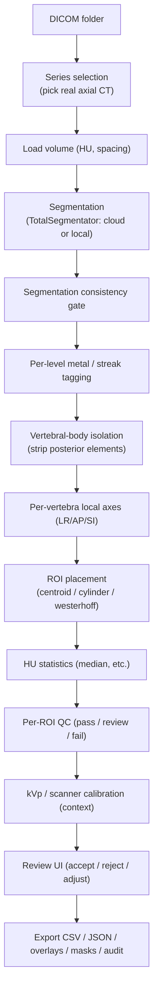

# Architecture & Rationale

This document explains **what the Spine Vertebral-HU Tool is, how it is put
together, and — most importantly — *why* it is built the way it is.** It is the
map for the per-package `README.md` files scattered through the codebase.

---

## 1. What problem this solves

A CT scan already contains a quantitative bone-density signal: the **trabecular
(cancellous) Hounsfield Unit (HU)** inside a vertebral body correlates with bone
mineral density. "Opportunistic" screening reads that number off CTs that were
ordered for other reasons — no extra scan, no extra dose.

The catch is **reproducibility**. If you place the measurement region by hand (or
by an HU-seeking heuristic), the number moves depending on *where* you sampled.
That variability is what makes opportunistic HU hard to trust clinically.

**This tool's job: measure trabecular HU per vertebra in a way that is
reproducible, transparent, and reviewable by a physician.**

It is explicitly **not** a diagnostic device. It reports a measurement (plus soft
literature context), not an osteoporosis diagnosis — see §6.

---

## 2. Design philosophy: "ML for the eyes, math for the ruler"

The single most important design decision:

> The only machine-learning component is **vertebra localization/segmentation**
> (pretrained [TotalSegmentator](https://github.com/wasserth/TotalSegmentator),
> used off the shelf — never trained or fine-tuned by us). **Every measurement
> step is deterministic image processing.**

Why:

- **Auditability.** A physician (or reviewer/regulator) can follow exactly how a
  number was produced: which voxels, which geometry, which thresholds. There is
  no opaque model deciding the HU.
- **Reproducibility.** Deterministic geometry gives the *same* answer for the
  *same* input, every time — no training seed, no model drift.
- **Overridability.** Because placement is geometric, the reviewer can nudge the
  ROI and the number updates predictably.
- **We use ML only where humans are also fuzzy** (finding/segmenting the bone),
  and math where precision matters (the ruler).

---

## 3. End-to-end data flow

The heavy ML (segmentation) happens once and is cached; **everything downstream
is deterministic and fast.**

---

## 4. Array & coordinate conventions

Consistent conventions prevent an entire class of silent bugs:

- Arrays are indexed **`[x, y, z]`**:
  - axis 0 = x = Right-Left (columns)
  - axis 1 = y = Anterior-Posterior (rows)
  - axis 2 = z = Superior-Inferior (slices)
- `spacing = (sx, sy, sz)` in **millimeters**, matching the array axes.
- This matches nibabel's on-disk order for the LPS axial volumes we work with.

Because CT voxels are **anisotropic** (in-plane pixels are often ~0.5 mm while
slices are 2.5-3.75 mm), all geometry is done in physical millimeters, not voxel
counts. This is why distance transforms and spheres are always spacing-aware.

---

## 5. Key design decisions and their justification

### 5.1 Reproducibility-first ROI placement (centroid-anchored)
An earlier "largest safe sphere at the distance-transform maximum" landed in
different anatomical spots across scans, producing an **L1 scan-rescan gap of
~37 HU**. Anchoring the ROI at the **vertebral-body centroid in the body's own
local frame** made placement depend on **anatomy alone** (not on the HU values
being measured), dropping the L1 gap to **~7 HU**. Reproducibility is the whole
point, so the default mode is placement-by-anatomy. See `spine_hu_tool/roi/`.

### 5.2 Local per-vertebra axes
Spines are curved (kyphosis/lordosis/scoliosis). "Central slice" and "endplate
margin" are only meaningful in the vertebra's *own* orientation, so we compute a
per-vertebra LR/AP/SI frame (PCA, snapped to global axes) rather than trusting
image axes. See `spine_hu_tool/geometry/`.

### 5.3 Vertebral-body isolation (deterministic, adaptive)
The trabecular measurement must exclude the posterior elements and the cortical
rind. A morphological opening strips the pedicles; the radius is **searched
adaptively** because one fixed size annihilates small vertebrae or leaves
posterior elements attached. See `spine_hu_tool/roi/body_isolation.py`.

### 5.4 Metal is quarantined, not measured
Hardware (screws, cages) and its streak/bloom artifact destroy HU. Levels with
metal inside are **excluded**; neighbors within the streak buffer or adjacent to
an instrumented level are **downgraded to review**. Excluded levels are still
*shown* (so the reviewer sees the hardware) but carry no HU. See
`spine_hu_tool/measurement/level_qc.py`.

### 5.5 A segmentation consistency gate
TotalSegmentator can mislabel or over-/under-segment, especially near metal.
Before trusting a mask we check per-label volume, SI ordering, non-adjacent
overlap, and spacing, and mark the whole segmentation `ok` / `suspect` /
`invalid`. This catches "the model produced a plausible-looking but wrong mask"
without any ground truth. See `spine_hu_tool/segmentation/consistency.py`.

### 5.6 Calibrate for comparability, but don't diagnose
Trabecular HU depends on tube voltage (kVp) and scanner model. We apply the
Westerhoff et al. linear kVp/scanner factors so values are comparable, and we
surface a **soft L1 literature anchor (Pickhardt)** as context. We deliberately
**do not** output an osteoporosis/osteopenia class in the main flow: diagnostic
thresholds are ROI-method- and cohort-specific and must be clinically validated
against a labeled reference set first. See `spine_hu_tool/measurement/calibration.py`.

### 5.7 Cloud-offloaded segmentation by default; on-demand local
TotalSegmentator is the only RAM/GPU-heavy step (it OOMs ~8 GB laptops). So the
packaged app is **lean** and offloads segmentation to a hosted service by
default — only the CT volume is uploaded; all measurement/QC/review stays local.
Users who want no-upload processing can install a **self-contained local runtime
on demand** (see §5.8). See `spine_hu_tool/segmentation/backends.py` and
`spine_hu_tool/server/`.

### 5.8 On-demand local runtime with zero prerequisites
A frozen desktop app has no pip/site-packages to install into, and we refuse to
require a preinstalled Python. So the one-time "set up local segmentation" step
bootstraps [`uv`](https://github.com/astral-sh/uv) (a single static binary),
which **downloads its own standalone CPython** and installs CPU PyTorch +
TotalSegmentator + weights into a user-writable environment outside the app
bundle. This keeps the installer at ~130 MB while letting anyone opt into local
processing. See `spine_hu_tool/segmentation/local_setup.py`.

### 5.9 Everything is recorded (reproducibility + audit)
Each export includes a `reproducibility.json` (tool version, full config, params,
calibration, segmentation status, volume metadata, and every measurement) plus
an append-only physician **audit trail**. The measurement should be
regenerable and the review defensible. See `spine_hu_tool/export/`.

---

## 6. Validation & limitations

- Trust is built by **internal consistency** (scan-rescan agreement, ROI-method
  agreement) and **literature anchoring**, since there is no external
  ground-truth calibration. See `spine_hu_tool/validation/` and
  `validation/REPORT.md`.
- **Intended use:** a physician-reviewed screening/quantification aid, **not** a
  standalone diagnostic device.
- Trabecular HU depends on scanner, kernel, kVp, and contrast — compare only
  within consistent protocols; prefer STANDARD-kernel non-contrast values.
- Levels with hardware (or within the streak buffer) are excluded and must not be
  reported; partial/edge vertebrae are flagged for review.

## 7. Out of scope

PHI/de-identification handling; training a custom segmentation model; large-scale
batch infrastructure; formal regulatory submission (intended use documented only).

---

## 8. Where to read next

| Area | Package | Doc |
|------|---------|-----|
| Package map & pipeline order | `spine_hu_tool/` | [README](../spine_hu_tool/README.md) |
| DICOM in, series choice | `io/` | [README](../spine_hu_tool/io/README.md) |
| HU rescale math | `preprocessing/` | [README](../spine_hu_tool/preprocessing/README.md) |
| The only ML + safety gate | `segmentation/` | [README](../spine_hu_tool/segmentation/README.md) |
| Local frames, morphology | `geometry/` | [README](../spine_hu_tool/geometry/README.md) |
| Body isolation, ROI modes | `roi/` | [README](../spine_hu_tool/roi/README.md) |
| HU stats, QC, tagging, calibration | `measurement/` | [README](../spine_hu_tool/measurement/README.md) |
| Overlay rendering | `visualization/` | [README](../spine_hu_tool/visualization/README.md) |
| CSV/JSON/masks/audit | `export/` | [README](../spine_hu_tool/export/README.md) |
| GUI, CLI, review state | `app/` | [README](../spine_hu_tool/app/README.md) |
| Segmentation service | `server/` | [README](../spine_hu_tool/server/README.md) |
| Internal-consistency checks | `validation/` | [README](../spine_hu_tool/validation/README.md) |
| Tests | `tests/` | [README](../spine_hu_tool/tests/README.md) |
| Installers & distribution | `packaging/` | [README](../packaging/README.md) |
