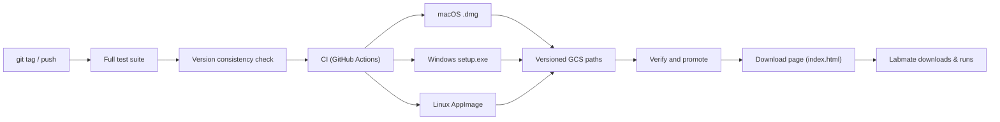

# `packaging/` — installers & distribution

How the tool gets onto a physician's or labmate's machine. The goal: a
**double-clickable native installer for every OS, no Python required**, small
enough to download over the web.

| Path | What it is |
|------|-----------|
| `spine_hu.spec`, `spine_hu_app.py` | PyInstaller build spec + app entry. |
| `make_icons.py`, `icons/` | Generate `.icns` / `.ico` / `.png` app icons. |
| `macos/build_dmg.sh` | Build the macOS `.dmg`. |
| `windows/installer.iss` | Inno Setup script → Windows setup wizard. |
| `linux/build_appimage.sh` | Build the Linux AppImage. |
| `download/index.html`, `version.json` | The public download page + version metadata. |
| `upload_to_gcs.sh` | Publish page + installers to the public GCS bucket. |
| `sync_version.py` | Propagate one version number to every file that ships one. |
| `SIGNING.md` | Code-signing notes. |

## One version number

`spine_hu_tool.__version__` is the source of truth, because it is what every
export stamps into `reproducibility.json` as `tool_version` — the field that
ties a measurement back to the code that produced it. A build that advertises
one version while stamping another makes that field worthless.

`pyproject.toml` and `spine_hu.spec` read the attribute directly. Inno Setup
cannot (it has no way to run Python) and the download page's `version.json` is
served as a static file, so those two carry a copy that `sync_version.py`
rewrites:

```bash
python packaging/sync_version.py --set 0.1.4   # cut a release
python packaging/sync_version.py --check       # what CI runs
```

CI runs `--check` before building anything, and on a tag push it additionally
requires `__version__` to equal the tag, so `v0.1.4` cannot ship binaries whose
exports identify themselves as `0.1.3`.

## Why full offline installers

The current release bundles Python, PyTorch, TotalSegmentator, and both model
weight sets so segmentation works locally with no setup or network connection.
That makes each installer several GB; the cloud backend remains available as an
option inside the app.

## Why native installers per OS

Labmates run macOS, Windows, and Linux and are not developers. A per-OS native
installer (`.dmg`, Inno Setup wizard, AppImage) is the lowest-friction path — no
terminal, no `pip`, no Python version to match. First-launch friction from
unsigned apps is documented in the top-level README (right-click → Open on macOS,
"More info → Run anyway" on Windows SmartScreen).

## Why GCS distribution (public-but-unlisted)

The code lives in a **private** GitHub repo, but installers are published to a
**public-but-unlisted GCS bucket** so labmates can download without a GitHub
login or credentials. `upload_to_gcs.sh` publishes the download page and version
metadata with `no-cache` (so updates show immediately) and installers with a long
cache (immutable per release). On a tag push, CI tests the code, builds all three
native installers, uploads them to the versioned path, verifies every object,
then updates `latest/` and publishes `version.json` last. Manual workflow runs
upload only to a `manual-*` path and cannot replace the live release.

The release workflow requires `GCP_SA_KEY`, `GCP_PROJECT`, and `GCS_BUCKET`.
The service account needs object list/get/create/delete access on that bucket
(for example, Storage Object Admin) because final promotion verifies versioned
objects and copies them to the `latest/` compatibility paths.

## Distribution flow


